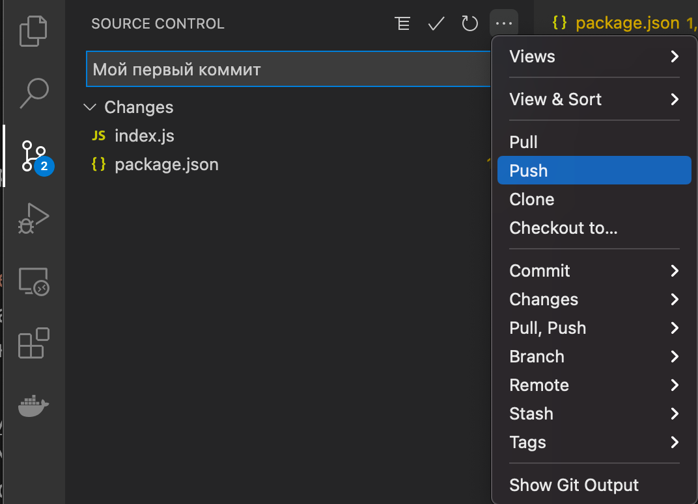

# Подготовка рабочего места

Рабочее место программиста это компьютер и программы, которые будут помогать тебе программировать. Я не буду рассказывать про учебные программы, мы сразу начнем по взрослому. И, как взрослый, первое, что ты должен научиться делать это уметь задавать вопросы. Если что-то тебе не понятно - не стесняйся - пиши: chernov.sergey@gmail.com. Я могу ответить не сразу, но постараюсь отвечать на все вопросы.

## JavaScript

JavaScript - это популярный язык программирования, именно его я знаю лучше всего и именно с его помощью ты будешь отдавать приказы Raspberry PI. Да, мир компьютеров суров, компьютеры не понимают просьбы, их не надо умолять, все, что ты скажешь им на понятным им языке будет немедленно исполнено, а JavaScript именно тот язык, который отлично понимают компьютеры и который легко может освоить ребенок.

Когда ты был еще совсем маленьким, а может быть тебя еще и не было, Javasript работал только внутри браузера и мог отдавать инструкции только ему, но так как язык был прост и вместе с этим очень мощен, то он быстро перекочевал в другие области, теперь с его помощью можно сделать и серверное приложение, и мобильное и управлять умным домом.

## NodeJS

Для работы `JavaScript` на компьютере надо поставить `NodeJS` - это среда выполнения, построенная на базе движка V8, работающего также в браузере Chrome.

Cкачай и установи последний [LTS дистрибутив для своей операционной системы](https://nodejs.org/ru)

> Если у тебя операционная система Ubuntu, то установи nodejs через Ubuntu Software.

В зависимости от операционной системы, возможно, потребуется перезагрузка.

После установки убедись, что все отлично, для этого в терминале, или командной строке, набери команду: `node -v`.

> Кстати, если ты не знаешь, что такое терминал или командная строка, то лучше пройди бесплатный курс ["Основы командной строки"](https://ru.hexlet.io/courses/cli-basics?ref=366190)

## Среда разработки

Для разработки на JavaScript можно использовать любой текстовый редактор, но так уж повелось, что разработчики отдают предпочтение специальным средам, которые обеспечивают подсветку синтаксиса, различные подсказки, средства автоматизации и многое другое.
Наиболее популярной средой на сегодняшний день является Visual Studio Code.

### Установка

Скачай и установи дистрибутив на ваш персональный компьютер
https://code.visualstudio.com/download

### Клонирование git репозитория


1. Перейди в закладку `Source Control`

2. Нажмите кнопку `Clone Repository`

3. Выбери из подсказки `Clone from GitHub`

4. Далее вставь адрес до репозитория с уроками: `https://github.com/sergeychernov/raspberry-pi-zero.git` и папку, куда он будет клонирован, например, создай новую папку projects в домашней дирректории.

## Создаем репозиторий в github

Что такое github? Это социальная сеть для программистов, которая позволяет обмениваться между собой исходными кодами.

Данный раздел очень важен для понимания, так как каждый опыт мы будем начинать с создания нового репозитория, так как с его помощью программа будет попадать на `Raspberry Pi`. Это, конечно, не единственный способ, но самый удобный и принятый среди профессиональных программистов.

### Регистрация

Если у тебя до сих пор нет аккаунта на GitHub, сейчас самое время его завести. 

1. Для этого перейди по ссылке: https://github.com/

2. После этого нажми на кнопку Sign up и, следуя инструкциям, создай аккаунт.

### Создание нового репозитория

1. Кликни по кнопке `new`

2. В `Repository name` укажите `hello`

3. Выбири пункт `Add a README file`, это нужно для полноценного создания репозитория.

4. Нажмите кнопку `Create repository`

## Инициализация проекта

1. Клонируй только что созданный репозиторий, как ты уже делал до этого с репозиторием с уроками.

2. Открой в `Visual Studio Code` папку с клонированным репозиторием.

3. Открой терминал в `Visual Studio Code` из верхнего меню.

4. Выполни команду `npm init`. Соглашайся со всем, нажимая кнопку `Enter`.
В результате получишь файл `package.json` с описанием проекта.

## Hello, world!

Все когда-то с чего-то начинали, в мире программистов принято начинать с программы, которая здоровается с миром.

1. В боковом меню `Visual Studio Code` Нажми на верхнюю иконку `Explorer`. Откроется Explorer. Со списком файлов проекта.

```
package.json
README.md
```

2. Наведи на имя проекта `HELLO`, появится меню с иконками. Нажмите на самую первую иконку `New File`. В строке ввода набери имя файла `index.js` и нажми `Enter`.

3. Введи следующую строку в файле:
```js
console.log( "Hello, World!" );
```

`console` - это самый популярный объект программирования. `log` - самый популярный метод, для вывода информации в терминал. Тебе придется использовать его постоянно для поиска ошибок в программах и для отладки своих алгоритмов, редко какая программа работает с первого раза.

4. Необходимо сохранить файл на диск, для этого в меню `File` выбери пункт `Save`. Чтобы не приходилось каждый раз нажимать на этот пункт, можешь сразу в меню `File` выбрать пункт `Auto Save`

5. Твоя первая программа готова. Чтобы запустить ее введи в `Terminal`:

`node .`

6. И нажми `Enter` и ты увидишь, как она запустилась и в консоли появится долгожданное приветствие.

## Консольная команда hello

Мы можем запускать наши программы с помощью интерпретатора, node, но для этого надо каждый раз писать перед командой имя интерпретатора и путь до команды, чтобы этого не делать нужно кое-что добавить в проект.

### Shebang

`Shebang` - в программировании последовательность из двух символов:`#!`) в начале файла скрипта. Это подсказка операционной системе Linux, о том где находится интерпретатор для исполнения скрипта.

Добавь в файл `index.js` в первой строкой:

`#!/usr/bin/env node`

### package.json

Как я уже рассказывал выше `package.json` это файл описывающий проект, но описывает он его не для нас, а для менеджера пакетов `npm`. Мы еще не раз будем возвращаться к нему, но сейчас нам нужно добавить туда только одну инструкцию:

```json
"bin": {
   "hello": "./index.js"
 }
```

Заметь, что между инструкциями должна быть запятая, это требование формата файла `JSON`.  `Visual Studio Code` подскажет тебе о синтаксических ошибках, но я приведу пример файла на всякий случай:

```json
{
  "name": "hello",
  "version": "1.0.0",
  "description": "",
  "main": "index.js",
  "scripts": {
    "test": "echo \"Error: no test specified\" && exit 1"
  },
  "repository": {
    "type": "git",
    "url": "git+https://github.com/sergeychernov/hello.git"
  },
  "author": "",
  "license": "ISC",
  "bugs": {
    "url": "https://github.com/sergeychernov/hello/issues"
  },
  "homepage": "https://github.com/sergeychernov/hello#readme",
  "bin": {
    "hello": "./index.js"
  }
}
```

> Если у тебя остались вопросы, можешь посмотреть [пример тут](https://github.com/sergeychernov/hello/tree/6f53634bdb28e01b781b2a5cb959ee7123ffad1d)

### Установка и удаление скрипта

Теперь твоя цель сделать так, чтобы скрипт запускался откуда угодно. Для этого в терминале `Visual Studio Code` выполни команду.

`npm install -g .`

> Если у вашего пользователя нет достаточно прав, то выполни эту команду в режиме суперпользователя `sudo npm install -g .`

Эта команда устанавливает скрипт глобально. Любая команда в разделе `bin` доступна как приложение командной строки. Теперь ты можешь запускать программу просто написав `hello` в командной строке, из любой дирректории.

Чтобы удалить установленный скрипт, выполни следующую команду:

`npm uninstall -g hello`

## Commit и Push

Теперь ты убедился, что программа работает, залей ее в репозиторий:

### Конфигурация Git

Для того, чтобы заливать в репозиторий свой код, надо сперва сконфигурировать git на локальном компьютере. Эту операцию надо сделать один раз. Введи следующие две команды, не забудь указать правильный email и имя.

```
git config --global user.email "Твой email"
git config --global user.name "Твое имя"
```

### Зальем код в репозиторий

1. Перейди на вкладку `Source Control`, набери сообщение, например как на рисунке ниже, и нажми на галку, обозначенную стрелкой.
 Таким образом ты создал слепок репозитория, но пока он у тебя на компьютере.

2. Чтобы твой код попал в репозиторий, нажми на троеточие и в дополнительном меню выбери Push.


3. Теперь твой код в репозитории и им может воспользоваться любой, в том числе и ты для клонирования его на Raspberry Pi.

## Что дальше?

Теперь, если Raspberry PI у тебя, ты можешь приступать к [следующей главе](003-raspberry-pi-preparation).

А если нет, то самое время освоить бесплатный курс ["Основы командной строки"](https://ru.hexlet.io/courses/cli-basics?ref=366190)

[К оглавлению](../index.md)
