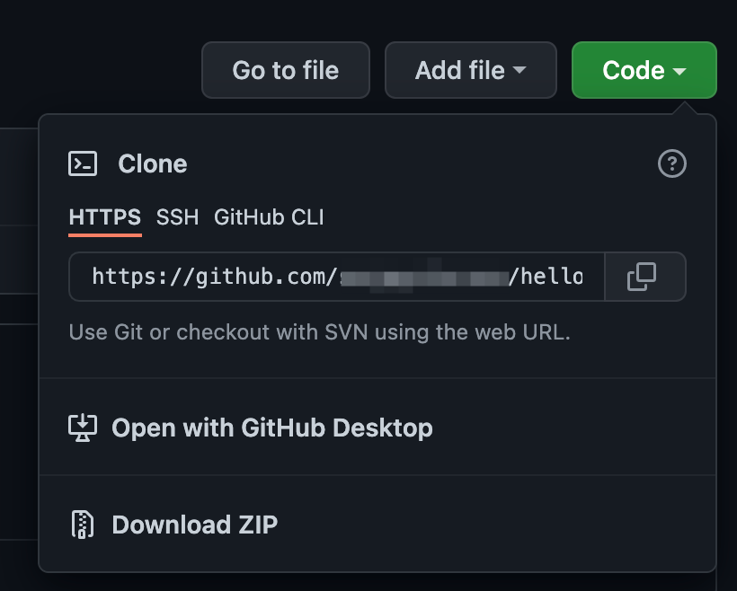

# Подготовка Raspberry Pi

Разные платы Raspberry Pi имеют разную архитектуру процессоров, ARM v6 для Zero и ARM v8 для остальных моделей. В связи с этим некоторые части данной главы будут отличаться, будь внимательным.

## Установка операционной системы Linux на Raspberry PI ARM v6

Для начала установи последнюю версию Raspberry PI OS LITE (32-bit).

1. Вставь **micro SD карту** в компьютер, если есть соответствующий слот или с помощью [Micro SD Card Reader](https://aliexpress.ru/item/1005002256132372.html).

2. Скачай, установи и запусти [Raspberry Pi Imager](https://www.raspberrypi.org/software/)

3. Выбери **Raspberry PI OS LITE (32-bit)**

4. Выбери в качестве **Storage** свою SD карту.

5. Нажми Write и дождись окончания записи.

Операционная система записана на **micro SD**, но это еще не все.

## Установка операционной системы Linux на Raspberry PI ARM v8

TODO:

## Подключите Raspberry PI к Wifi и включите ssh.

Сначала подключи твою **micro sd карту** к компьютеру, компьютер увидет ее с именем тома boot. В корне тома создай файл `wpa_supplicant.conf` со следующим содержанием:
```
country=RU
ctrl_interface=DIR=/var/run/wpa_supplicant GROUP=netdev
network={
    ssid="Имя Wifi сети"
    psk="Пароль Wifi сети"
    key_mgmt=WPA-PSK
}
```

Создай пустой файл `ssh` в корне тома.

Безопасно отключи micro sd карту и вставь ее в Raspberry PI.

Подключай к Raspberry PI блок питания в слот обозначенный PWR, жди пару минут и можете подключайся:

1. Набери в консоли: `ssh pi@ТВОЙ_IP`

> `ТВОЙ_IP` адрес можно узнать, из списка подключенных устройств на роутере, либо подключив Raspberry PI к монитору, но для этого нужен переходник с **mini HDMI**.

> Если у тебя Keenetic роутер - тебе повезло. Узнай его адрес (обычно http://192.168.1.1/) и логин/пароль (Логин обычно имеет значение «admin», а пароль — «admin» или «1234», если их не поменяли).
Далее в закладке  **Мои сети и WI-FI/Список устройств** найти устройство, перейди в его настройки и зарегистрируй его, можешь назвать его как-нибудь вроде **my pi**. И снова зайди в настройки уже зарегестрированного устройства и проставь галочку **Постоянный IP-адрес**, и увидишь адрес **Raspberry PI**, нажми сохранить и наслаждайся.

2. Он попросит ввести пароль (по умолчанию `raspberry`).

3. Все, ты внутри:

```
pi@raspberrypi:~ $
```

## NodeJS установка ARM v6

1. Подключись к Raspberry PI по ssh, как написано выше.

2. Скачай последний релиз nodejs, в примере 16.9.1 (помни, что начиная с 12 версии, они не стабильные, но для обучения и наших опытов это не имеет значения):

`wget https://unofficial-builds.nodejs.org/download/release/v16.9.1/node-v16.9.1-linux-armv6l.tar.xz`

3. Распакуй архив:

`tar xvfJ node-v16.9.1-linux-armv6l.tar.xz node-v16.9.1-linux-armv6l/`

4. Скопируй в дирректорию local:

`sudo cp -R node-v16.9.1-linux-armv6l/* /usr/local`

5. Удали архив и распакованную версию из домашней дирректории:

`rm -rf node-*`

6. Перезагрузи наш миникомпьютер:

`sudo reboot`

7. Подожди пару минут, подключись по ssh, как написано выше. Проверь что все работает:

`node -v && npm -v`

8. Ты увидишь установленную версию nodejs и npm. Молодец!

## Установка Git

Git это система контроля версий. Дело в том, что мы не будем разрабатывать на raspberry pi zero, это возможно но абсолютно не удобно. Мы будем разрабатывать для raspberry pi zero на своем персональном компьютере. И git нам понадобится, чтобы поставлять наши программы на raspberry pi zero.

1. Чтобы установить git выполни следующую команду:

`sudo apt install git`

2. Если все прошло правильно, то следующая команда должна вывести версию git

`git --version`

## Запуск программы hello на raspberry pi

На предыдушем уроке ты создал консольное приложение hello, теперь ты научишься запускать его на raspberry pi.

1. Если ты не подключен, то подключись по ssh к Raspberry Pi

2. Склонируй репозиторий созданный в предыдущем уроке на raspberry pi

`git clone АДРЕС_РЕПОЗИТОРИЯ`

> Адрес для клонировая посмотри на github.com:


3. Перейди в папку с репозиторием:

`cd hello`

4. Запусти nodejs для текущей папки

`node .`

Ты увидишь, что скрипт написанный на компьютере отработал и на Raspberry Pi

5. Установи скрипт глобально, в режиме суперпользователя.

`sudo npm install -g .`

6. Теперь перейди в любую папку, например в корень (`cd /`) и выполни:

`hello`

7. Теперь эта команда доступна отовсюду, будь осторожен и не перезапиши случайно внутреннюю команду :) Теперь, если хочешь можешь удалить команду, потому что в следующем уроке я покажу тебе как ее модифицировать.

`sudo npm uninstall -g hello`

## Выключение Raspberry PI

Чтобы выключить надо выполнить следующую команду:

`sudo shutdown -h now`

[К оглавлению](../index.md)
